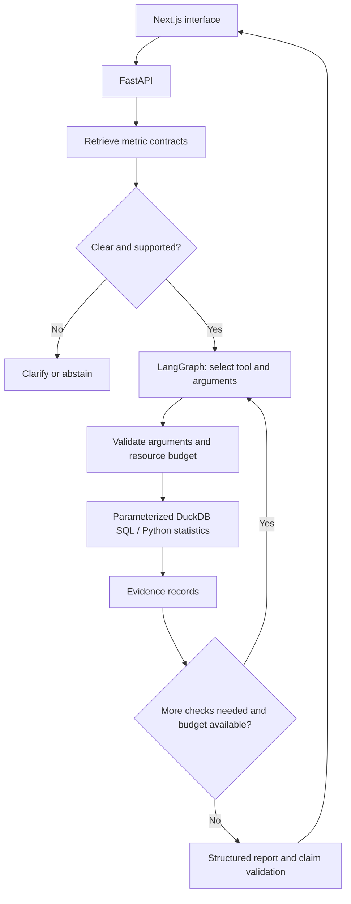

# MetricPilot

**Product analytics investigations with verifiable evidence.**

MetricPilot is a planned analytical agent for answering three bounded questions about a synthetic interview-preparation SaaS: why a metric changed, where a funnel changed, and whether an A/B experiment supports a decision.

**Status: design and build preparation. Application implementation has not started.** This repository currently contains specifications and a learning-oriented roadmap. It does not yet contain a runnable agent, generated dataset, measured evaluation results, or a deployed application.

| Deliverable | Status |
| --- | --- |
| Product specification and architecture | Documented |
| Synthetic data and SQL/statistical tools | Planned |
| LangGraph agent and retrieval | Planned |
| FastAPI backend and Next.js interface | Planned |
| Frozen benchmark and measured results | Planned |
| Live public demo and walkthrough video | Not deployed / not recorded |

## The problem

A product manager asks: “Why did activation fall last week?” A useful answer needs the correct metric definition, complete observation windows, reproducible calculations, and a distinction between descriptive evidence and causal conclusions.

MetricPilot is designed to retrieve metric contracts, select validated analytical tools, and produce a report whose numerical claims can be traced to SQL and tool results. When the data or question is insufficient, it should ask for clarification or abstain.

## Planned supported tasks

1. **Metric investigation:** compare complete time windows and decompose a conversion-rate change by acquisition channel or device.
2. **Funnel investigation:** identify changes across signup, practice start, and practice completion, with explicit user-level denominators.
3. **Experiment review:** check one predeclared user-level binary outcome, including assignment validity, sample ratio mismatch, effect size, and confidence interval.

The MVP supports one synthetic SaaS schema and one segmentation dimension per investigation. It will not execute arbitrary model-generated SQL, upload private user data, or make causal claims from observational segments.

## Planned architecture

The LLM chooses permitted actions. Python owns validation, computation, access restrictions, and stopping conditions. A tool trace is an execution record, not a disclosure of private model reasoning.

## Proposed stack

- **Backend:** Python, FastAPI, Pydantic.
- **Agent:** LangGraph and a model supporting tool calling and structured outputs.
- **Analysis:** DuckDB, SQL, pandas, SciPy.
- **Retrieval:** embeddings over a small versioned metric-contract collection; in-memory similarity search.
- **Frontend:** Next.js and TypeScript.
- **Verification and delivery:** pytest, Docker, GitHub Actions; add these when implementation exists.

These are design choices, not an inventory of implemented features. Runtime/package versions and hosting prices will be checked when implementation begins. DuckDB and a small in-memory retrieval index keep the MVP understandable; a hosted vector database is not required.

## Build it by hand

The owner intends to implement and understand every component before presenting it as completed work. Start with the [first milestone](docs/BUILD_PLAN.md#m1--data-and-metric-contracts-3-days), then build deterministic tools before adding an LLM.

- [Build plan and acceptance criteria](docs/BUILD_PLAN.md)
- [Architecture and tool boundaries](docs/ARCHITECTURE.md)
- [Data, metric, and statistical contracts](docs/DATA_AND_METRICS.md)
- [Evaluation protocol](docs/EVALUATION.md)
- [Deployment checklist](docs/DEPLOYMENT.md)
- [60-second demo](docs/DEMO.md)
- [Resume claims and evidence requirements](docs/RESUME_EVIDENCE.md)
- [Working agreement](CONTRIBUTING.md)

## Run locally

There is no application to run yet. Setup commands, dependency locks, environment examples, and service entry points will be documented after the corresponding components have been implemented and tested. Do not treat the roadmap as a working quickstart.

## Evaluation

Planned: 30 development cases and 30 frozen test cases, an explicitly defined single-pass baseline, deterministic numerical scoring, and repeated runs to measure instability. A proposed release gate is at least 24/30 whole-task passes on the frozen test set, with all predefined critical failures handled correctly. No benchmark has been executed and no accuracy, latency, or cost result is claimed.

See [the protocol](docs/EVALUATION.md) for failure definitions, split rules, scoring, and reporting requirements.

## Limitations / what I would do next

The initial implementation is scoped to synthetic SaaS data and a bounded set of analytical tasks. Results will not establish reliability on arbitrary business databases. SQL will be compiled from validated parameters rather than generated and executed freely. Segment decompositions will be descriptive, not causal. Experiment analysis will cover one predeclared user-level binary outcome at a fixed horizon; sequential testing and multiple-comparison correction are outside the MVP.

Automated checks can validate numerical claims and evidence references, but cannot guarantee that every narrative interpretation is correct. The eventual public demo will be rate-limited and will not establish enterprise-scale reliability.

Next work should follow measured failures: improve the weakest supported task, expand contracts where needed, obtain independent review, and evaluate on explicitly permitted real data. More agents or frameworks are not a default next step.

## Ownership and claims

The repository owner is responsible for implementation and verification. Planning materials were prepared with AI assistance; no application implementation is attributed to the owner yet. Future claims must identify the exact implementation version, data version, and measured result. Synthetic events must never be described as real users or production traffic.
