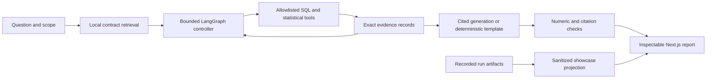

# MetricPilot

### Evidence, all the way down.

**Research prototype · partial live-model evaluation.** The final primary synthetic attempt stopped after **10/180** planned responses: **7** passed automatic checks, **3** were withheld, and **170** were not attempted. This is not a completed protocol score or release-qualified model result.

**An inspectable analytics application: question → metric contract → bounded tool → SQL evidence → cited answer → verification.**

MetricPilot combines **Next.js, FastAPI, LangGraph, DuckDB and local MiniLM retrieval** to investigate product metrics and a real public retail dataset. The dashboard puts the question, result and evidence trail beside one another, then makes the SQL, source contracts, execution trace and evaluation record available for inspection.

[Explore the code](app/components) · [Evaluation protocol](docs/EVALUATION.md) · [Architecture](docs/ARCHITECTURE.md) · [Run locally](#run-locally) · [MIT license](LICENSE)

## Start with the recorded showcase

The default interface is a **static, recorded-results dashboard**. It makes no model requests and needs no API key or backend to inspect:

- A genuine recorded live-model funnel investigation, including cited claims, exact SQL, retrieved metric contracts, token usage and estimated cost
- Historical public-retail investigations in recorded live-model and deterministic modes, with audited source data and reconciled country contributions
- Separate numerical, retrieval and live-model evaluation views, including incomplete or failed runs rather than a manufactured success score
- A readable architecture view connecting each stage to its implementation

The recorded live sample is one execution, **not a model-quality benchmark**. Numerical and citation checks do not establish semantic correctness. Its review was AI-assisted, not a human-review claim. Each saved report links to the underlying artifact and shows its execution mode and date.

“Local workspace” preserves the original deterministic question-input flow when opened on localhost. Public/static hosting keeps server execution disabled, with setup instructions instead. The static showcase never invokes a paid model.

### Two investigations, two data boundaries

| Investigation | Dataset | What is shown |
| --- | --- | --- |
| Ordered practice funnel | 12,000 synthetic users, 50,504 synthetic events | Signup → practice start → completion, using mature cohorts and session-matched event ordering |
| Country sales contribution | 541,909 historical UCI invoice lines | October–November 2011 gross positive sales, exclusions, country contributions and independent reconciliation |

Synthetic outputs describe synthetic data. Public retail outputs are historical descriptive findings, not causal business impact, net revenue or profit.

## What the engineering demonstrates

- **Analytical correctness:** parameterized SQL tools with independent numerical references, explicit denominator and observation-window definitions, experiment validity checks and uncertainty intervals
- **Grounded generation:** retrieved contracts and executed evidence constrain live answers; the current generator selects verified facts and the server renders their numerical values
- **Controlled execution:** allowlisted actions, bounded calls, deadlines, fail-closed validation and persistent spending reservations; no model-generated SQL or shell execution
- **Transparent evaluation:** frozen synthetic cases, repeated runs, a disclosed single-pass baseline, mechanical checks, separate semantic review and preserved failure artifacts
- **Full-stack delivery:** reusable React dashboard components, typed report adapters, a sanitized static data projection, FastAPI endpoints and CI checks

Implemented with **AI assistance at the repository owner’s request**. This does not imply independent hand-authorship or that the owner has already demonstrated understanding. The [explanation guide](docs/INTERVIEW_GUIDE.md) provides concrete exercises for reproducing and defending the work.

## Measured evidence

These tracks answer different questions; their scores must not be blended.

| Track | Recorded evidence | Interpretation |
| --- | --- | --- |
| Deterministic regression | 30/30 cases in each of 3 repeated runs | Numerical/controller regression; not 90 independent cases or LLM accuracy |
| Contract retrieval | Semantic 9/10 top-1, 10/10 top-3; lexical 9/10 top-1, 10/10 top-3 | Ten development queries; no semantic-superiority claim |
| Public-data reconciliation | 39/39 independent checks | Historical retail totals and all comparison-country contributions |
| Recorded live smoke | 3 model calls, 3,466 tokens, $0.0018028 estimated API cost | One successful funnel sample; not a benchmark |
| Final primary paired attempt (v3) | 10/180 attempted; 7 automatic passes, 3 withheld, 170 unrun | Stopped on repeated grounding rejections; no full-protocol model score or release qualification |
| Historical v1 / v2 attempts | v1: 9/180 attempted, 3 automatic passes; v2 resumed: 45/180 attempted, 39 automatic passes | Separate failed histories; resumed checkpoint responses count once, not as a second trial |

Sources: [deterministic run](evals/results/deterministic-rag-20261002.json), [retrieval comparison](evals/results/retrieval.json), [retail checks](evals/results/retail.json), [recorded live smoke](evals/results/live-smoke-20261002.json), [final primary v3 attempt](evals/results/live-synthetic-v3-20261002.json), [historical v1](evals/results/live-synthetic-20261002.json), [historical resumed v2](evals/results/live-synthetic-v2-resumed-20261002.json).

All failed attempts are retained rather than overwritten. The dashboard defaults to the final primary v3 attempt and labels previous runs historical. Independent retail/adversarial supplements appear separately as **execution blocked**, with no recorded outcomes: retail had 8 planned responses and adversarial had 12. The retail admission has no saved provider response, so its actual attempted outcome is unknown; adversarial did not start. Earlier successful development samples are not substitutes for these missing checks. Consult the exact run’s protocol, source hashes, attempted count and review state; do not infer full release readiness from an automatic pass.

Blocked-status sources: [retail supplement](evals/results/live-retail-v3-20261002.json), [adversarial supplement](evals/results/live-adversarial-v3-20261002.json).

When grounding verification fails, the model narrative and generated findings are withheld while executed SQL evidence remains inspectable. This is a fail-closed guard outcome, not a correct completed analytical answer. Deterministic tools remain available locally without model API calls.

Estimated model costs use the recorded pricing/accounting basis. They are not provider invoices, spending reservations, or total hosting costs. The [deduplicated accounting record](evals/results/cost-accounting-20261002.json) separates returned-token estimates, uncertain usage and reserved allowance across interruptions.

## Architecture



| Layer | Responsibility | Boundary |
| --- | --- | --- |
| Next.js dashboard | Saved reports, charts, citations, evaluation and local input | No browser credentials; no paid calls from the showcase |
| FastAPI | Validate requests, concurrency and execution limits | Unsupported requests clarify or abstain |
| MiniLM retrieval | Rank versioned metric definitions locally | Similarity is relevance, not answer confidence |
| LangGraph | Select approved actions, or run the fixed retail workflow | The model cannot supply arbitrary SQL or code |
| DuckDB / Python | Execute maintained queries and statistical calculations | Read-only data and validated parameters |
| Generation / verification | Resolve selected facts and check references | Qualitative entailment requires separate review |
| Evaluation | Independent references, paired comparison and failure records | Deterministic, development and held-out evidence stay distinct |

The synthetic tasks cover activation change, ordered funnels and user-level onboarding experiments. The retail case follows a fixed workflow; it is not described as autonomous action selection.

## Run locally

Prerequisites: **Python 3.12** and **Node.js 22+**. Credentials are never required for the recorded showcase or deterministic analysis.

### Recorded dashboard only

```bash
git clone --branch feat/recorded-dashboard-rag-20261002 https://github.com/RickySun-hub/metricpilot.git
cd metricpilot
npm ci
npm run dev -- --hostname 127.0.0.1
```

Open `http://127.0.0.1:3000`. The saved results load directly from the checked-in sanitized artifact. `/retail` opens the public-data investigation directly.

```bash
npm run typecheck
npm run build
```

For a GitHub project site, set `METRICPILOT_BASE_PATH=/metricpilot` when building (PowerShell: `$env:METRICPILOT_BASE_PATH='/metricpilot'`). Leave it unset for root-domain hosting. When publishing a review branch, also set `METRICPILOT_SOURCE_REF` to that exact branch or commit so evidence links resolve to the published revision; the default is `main`. Verify with `node scripts/test-static-export.cjs /metricpilot` or without the argument for root hosting.

The build exports the recorded dashboard into `out/`. It can be served by a static host without a Python backend. Next.js warns that API rewrites are not applied to static exports; that does not affect saved-result inspection.

### Local deterministic investigations

Create and activate a Python virtual environment:

```bash
python -m venv .venv
```

Use `source .venv/bin/activate` on macOS/Linux or `.venv\Scripts\Activate.ps1` in PowerShell, then:

```bash
python -m pip install -r requirements.txt -r requirements-dev.txt
python -m uvicorn api.index:app --host 127.0.0.1 --port 8000
```

In a second terminal, configure the Next.js API rewrite and start development mode. macOS/Linux:

```bash
METRICPILOT_API_URL=http://127.0.0.1:8000 npm run dev -- --hostname 127.0.0.1
```

PowerShell:

```powershell
$env:METRICPILOT_API_URL='http://127.0.0.1:8000'
npm run dev -- --hostname 127.0.0.1
```

Open “Local workspace” in the dashboard and run a supported question. The form uses deterministic tools only. The static `out/` folder does not implement these API routes. [API and deployment details](docs/DEPLOYMENT.md).

### Reproduce verification and showcase data

```bash
python -m pytest -q
python -m evals.run --mode deterministic --split test --repeats 3
python -m evals.retrieval
python -m evals.retail
python scripts/build-showcase-data.py
python scripts/test-showcase-data.py
node scripts/test-dashboard.cjs
npm run typecheck
npm run build
```

The showcase builder reads saved JSON only. It does not invoke the model, execute analytical tools or read local credentials. It preserves report facts while dropping operational budget/provider fields, and ignores unfinished evaluation files. Source paths and dates stay attached to every record.

## Real public-data case study

- Audited all **541,909** original rows; retained **530,104** positive-quantity, positive-price, non-cancelled lines
- Recorded **135,080 missing customer IDs** and **5,268 repeated exact rows**; both are retained under the documented non-customer-level metric policy
- Compared complete October and November 2011: **GBP 1,154,979.30 → GBP 1,509,496.33**, a **GBP 354,517.03** difference
- Reconciled all **29** comparison-country contributions and monthly totals against separate Python/Decimal source-row accumulators
- Bundled month-country aggregates, without customer identifiers

Source: Chen (2015), UCI Online Retail, [DOI 10.24432/C5BW33](https://doi.org/10.24432/C5BW33), licensed [CC BY 4.0](https://creativecommons.org/licenses/by/4.0/). [Data audit and reproduction](docs/REAL_DATA.md).

## Optional live model execution

Live execution is separate from the public recorded showcase. The backend defaults to `METRICPILOT_ENABLE_LIVE=0`. Activation requires approved server-side credentials, an explicit spending allowance and the [documented controls](docs/DEPLOYMENT.md). Public live mode additionally requires shared durable quotas.

The code uses pinned `gpt-4.1-mini-2025-04-14`, structured responses, finite calls, duplicate-call rejection and prospective cost checks. Keep one persistent accounting ledger across calls and restarts. Do not reset it, increase the allowance or expose a public paid endpoint to improve a demo.

The current grounding schema uses model-selected verified facts with server-rendered numerical values. Earlier saved runs preserve their original method and provenance. Mechanical checks do not prove that every qualitative statement follows from its source.

## Limitations

- Narrow metrics, fixed demo windows and synthetic regression cases; not a general database copilot
- Maintained SQL templates; not unrestricted text-to-SQL
- Descriptive decomposition; no causal inference or measured business uplift
- Fixed-horizon binary experiments; no sequential testing or multiple-comparison adjustment
- Small retrieval development set; no demonstrated semantic advantage
- Live failures and incomplete benchmarks are part of the record
- No claim of real customer adoption, analyst time saved, production scale or permanent deployed service

## Repository guide

```text
app/components/     Shared recorded dashboard, evidence and evaluation views
app/data/           Sanitized checked-in showcase snapshot
api/                FastAPI analysis, health and evaluation endpoints
backend/            SQL tools, statistics, retrieval, controller and generation
contracts/          Versioned metric definitions
data/               Synthetic snapshot and public retail aggregates
models/             Pinned pretrained embedding assets and attribution
tests/              Numerical, API, safety and mocked-provider checks
evals/              Frozen cases, independent references and recorded results
scripts/            Showcase generation and frontend/data checks
docs/               Design, protocol, data audit and explanation guides
```

## License and attribution

Project code is available under the [MIT license](LICENSE), copyright 2026 Ricky Sun. The MIT grant does not replace upstream licenses: UCI retail data remains **CC BY 4.0**, and pretrained embedding weights retain their [upstream license and attribution](models/README.md).

## Earlier deployment record

An earlier deterministic UI was verified on a temporary anonymous Vercel deployment. Its recorded expiry was **October 1, 2026**, unless claimed; continuing ownership and availability are unverified. It is not the current dashboard or a permanent resume link.

[Earlier 47-second walkthrough](docs/assets/demo.webm) · [Earlier browser QA record](docs/assets/public-qa.json) · [Deployment history](docs/DEPLOYMENT.md)
