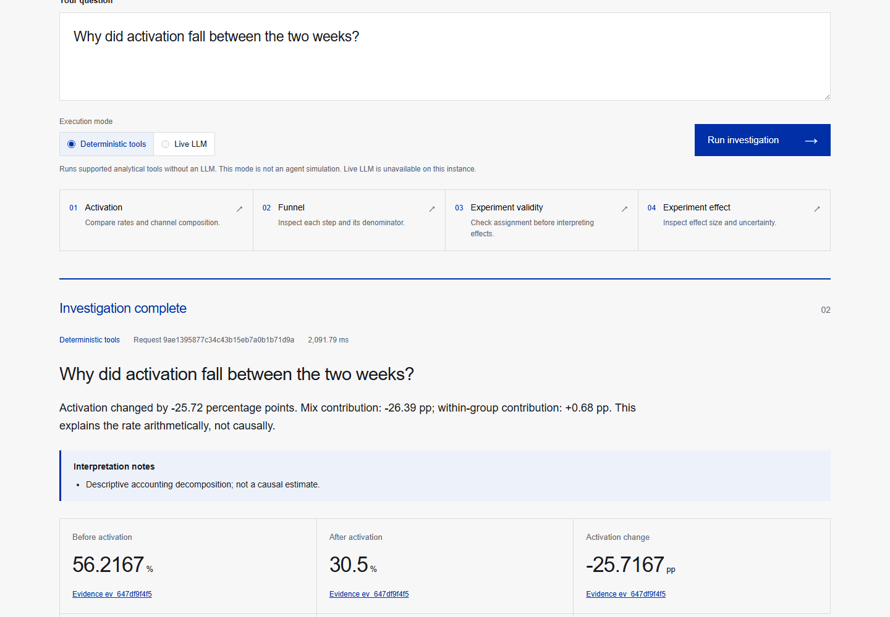
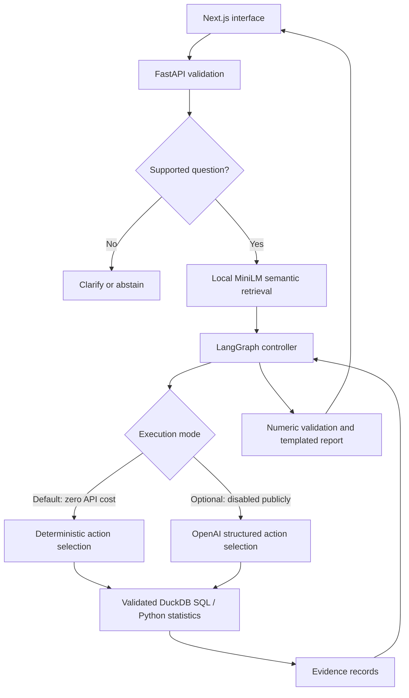

# MetricPilot

**Investigate product metrics. Inspect the evidence. Respect uncertainty.**

MetricPilot is an implemented analytics application with a Next.js interface, FastAPI backend, DuckDB tools, local semantic retrieval, and a bounded LangGraph controller. It investigates activation changes, ordered funnels, and user-level A/B experiments on **12,000 synthetic users and 50,504 synthetic events**.

It also includes a separate **real public-data case study** at `/retail`: **541,909 UCI Online Retail invoice lines** are audited and reduced to privacy-minimized month-country aggregates. A deterministic LangGraph workflow retrieves metric contracts, runs two parameterized DuckDB tools, and validates gross-positive-sales findings against their evidence. [Source, license, cleaning policy and independent numerical checks](docs/REAL_DATA.md).

**Execution boundary:** this zero-cost release runs real SQL and statistical calculations with a deterministic controller. An optional OpenAI action selector is implemented and covered by mocked safety tests, but **no real LLM calls, model-quality benchmark, or LLM-baseline comparison have been performed**. Deterministic mode is visibly labeled; it is not presented as a live LLM agent.

[Public demo — temporary, pending owner claim](https://temporary-quick-fiddle-x0gi9g1.vercel.app) · [Build issues](https://github.com/RickySun-hub/metricpilot/issues) · [Verification scope](docs/EVALUATION.md)

The anonymous demo was verified publicly for the earlier implementation. Its recorded expiry was October 1, 2026 at 02:00:24 UTC unless claimed; continuing ownership and availability are unverified. It is not a permanent resume/demo URL, and the new real-data case has not been deployed. No registration or API key is needed to run deterministic mode locally.

[Recorded public walkthrough (47 seconds, WebM)](docs/assets/demo.webm) — fresh activation analysis, executed SQL, SRM rejection, and an inconclusive experiment result. The recording preserves waiting time and uses deterministic mode throughout.



## What it does

| Question | Behavior | Evidence |
| --- | --- | --- |
| Why did activation change? | Compare mature signup cohorts and decompose channel/device mix versus within-group change | Counts, rates, exact decomposition, SQL and bound parameters |
| Where did the practice funnel change? | Compare signup → start → completion with ordered, session-matched events | User-level step counts and conditional rates |
| Is onboarding_srm trustworthy? | Detect sample ratio mismatch and withhold effect interpretation | Assignment counts, SRM p-value and validity status |
| Should we ship onboarding_valid? | Report a Newcombe 95% score interval and constrain the recommendation | Intent-to-treat counts, effect and uncertainty |

The demo uses fixed September 1–8 and September 8–15, 2026 signup cohorts, fully observed by September 30. “The two weeks” means these demo cohorts, not the current calendar. Unsupported metrics/windows are rejected or clarified.

On the default snapshot, activation falls from **56.2167% to 30.5%**. Inspect the exact mix/within-group contributions in the report. These are synthetic observations and an accounting identity, not real business impact or causal findings.

## Architecture



The optional model branch chooses approved actions; it never supplies executable SQL. Application code validates arguments, budgets and termination. Numerical claims come from tool evidence and are checked against result fields. Narrative uses deterministic templates, deliberately limiting flexibility and hallucination exposure.

Semantic retrieval uses a pinned, quantized **all-MiniLM-L6-v2** model with CPU ONNX Runtime, masked mean pooling and cosine similarity. There is no paid embedding endpoint or hosted vector database. Upstream weights are attributed in [models/README.md](models/README.md).

## Measured verification

- **149 tests passed locally**: independent numerical references, public-data import and SQL checks, safe API failures, deadline boundaries, restart/concurrent quota accounting, retrieval/tokenizer parity and mocked live safety.
- **30/30 deterministic regression cases passed in each of three repeated runs.** The 60-case manifest has 30 development/30 test cases with distinct scenario seeds. This is bounded synthetic regression, not live LLM accuracy.
- On **10 labeled development retrieval queries**, semantic and lexical retrieval both achieved **9/10 top-1 and 10/10 top-3** contract hits. This does not establish semantic superiority.
- Desktop **1440×1000** and mobile **390×844** flows checked with Playwright: four scenarios, evidence expansion, no page errors or horizontal overflow.

The desktop/mobile record above covers the earlier synthetic release. The new `/retail` page passes TypeScript and production build checks; its browser interactions and public deployment remain unverified. A local 40-request/8-thread API smoke and process restart passed, which does not establish hosted load capacity. [Current verification scope](docs/EVALUATION.md).

Measured records and omissions: [deterministic results](evals/results/deterministic.json), [retrieval comparison](evals/results/retrieval.json), [protocol](docs/EVALUATION.md). [GitHub CI passed for the implementation commit](https://github.com/RickySun-hub/metricpilot/actions/runs/36800913164); the public walkthrough and [browser checks](docs/assets/public-qa.json) were verified separately.

## Run locally

Prerequisites: **Python 3.12**, **Node.js 22+**. Never put credentials in commands or tracked files.

```bash
git clone https://github.com/RickySun-hub/metricpilot.git
cd metricpilot
python -m venv .venv
```

Activate `.venv` (`.venv\Scripts\Activate.ps1` on PowerShell; `source .venv/bin/activate` on macOS/Linux), then:

```bash
python -m pip install -r requirements.txt -r requirements-dev.txt
npm ci
python -m uvicorn api.index:app --host 127.0.0.1 --port 8000
```

In a second terminal set `METRICPILOT_API_URL=http://127.0.0.1:8000` and run `npm run dev`. PowerShell:

```powershell
$env:METRICPILOT_API_URL='http://127.0.0.1:8000'
npm run dev -- --hostname 127.0.0.1
```

Open `http://127.0.0.1:3000`; API docs: `http://127.0.0.1:8000/api/docs`. The repo includes the compressed synthetic snapshot and pinned local embedding assets. Reproduce inputs:

```bash
python -m backend.data
python -m backend.download_embedding_model
```

The second command downloads public pretrained assets, not paid inference. Run checks:

```bash
python -m pytest -q
python -m evals.run --mode deterministic --split test --repeats 3
python -m evals.retrieval
python -m evals.retail
npm run typecheck
npm run build
```

`npm run build` exports a static frontend to `out/`. Production also needs FastAPI; serving only `out/` does not provide analytics. A backend Dockerfile is included; Docker execution has not been verified locally.

Open `/retail` for the real-data case. It uses the bundled aggregate snapshot, so no workbook download, customer records, or additional runtime dependency is needed. To reproduce the optional offline import, follow [REAL_DATA.md](docs/REAL_DATA.md).

## Real public-data case study

- Audited all **541,909** historical source lines; retained **530,104** positive-quantity, positive-price, non-cancelled lines and excluded **11,805**
- Counted **135,080 missing customer IDs** and **5,268 repeated exact rows**; missing IDs and duplicates are explicitly retained for this non-customer-level metric
- Compared complete October and November 2011: **GBP 1,154,979.30 → GBP 1,509,496.33**, a **GBP 354,517.03** observed difference
- Reconciled all **29** comparison-country contributions and monthly totals against separate Python/Decimal source-row accumulators
- Kept this historical descriptive analysis separate from the frozen synthetic test suite, SaaS conversion/funnel claims, randomized experiments, and any live-model benchmark

The underlying data is Chen (2015), UCI Online Retail, [DOI 10.24432/C5BW33](https://doi.org/10.24432/C5BW33), licensed [CC BY 4.0](https://creativecommons.org/licenses/by/4.0/). These are gross positive sales under the documented exclusion policy, not net revenue, profit, or business uplift. [Executed public-data check](evals/results/retail.json).

## Optional LLM integration

The default/public configuration keeps `METRICPILOT_ENABLE_LIVE=0`. Live mode is not required for the working analytics demo. Later activation requires an approved server-side key, explicit budget and the [deployment controls](docs/DEPLOYMENT.md). Public live mode additionally requires shared durable quota storage.

The code uses a fixed GPT-4.1-mini snapshot, structured actions, finite calls, duplicate-call rejection, conservative cost preflight and evidence-only reports. These have mocked tests, not real-provider verification. Hosted Redis accounting is also unverified. Live benchmark/baseline are future work; the evaluation CLI refuses to invent them.

## Repository guide

```text
app/                Next.js input, reports, charts and evidence
api/index.py        FastAPI health, analysis and evaluation
backend/            Data, SQL tools, statistics, retrieval and graph
contracts/          Versioned definitions
data/               Synthetic snapshot and checksum manifest
models/minilm/      Pinned ONNX weights, tokenizer and attribution
tests/              Numerical, API, retrieval and mocked safety checks
evals/              Independent references, case manifest and results
docs/               Architecture, deployment, demo and claims guidance
```

## Limitations / next work

- Synthetic data, fixed windows and narrow task vocabulary; not a general database copilot.
- Deterministic public execution; real LLM selection and baseline remain unverified.
- Validated SQL templates, not unrestricted text-to-SQL.
- Descriptive decomposition, not causal inference.
- One user-level binary outcome at a fixed horizon; no sequential testing or multiple-comparison adjustment.
- No measured business uplift, time savings, real adoption or enterprise-scale reliability.
- Constrained report templates; no open-ended narrative analysis.

Next: separately authorize real-model evaluation, compare a baseline with disclosed information differences, obtain independent review, then expand scope based on failures.

## Ownership

Implemented with **AI assistance at the repository owner's request**. This does not imply the owner independently hand-authored every component or has already demonstrated understanding. Before interview claims, work through [the explanation guide](docs/INTERVIEW_GUIDE.md) and reproduce the checks. Pretrained weights belong to their upstream authors; no model training/fine-tuning is claimed.
